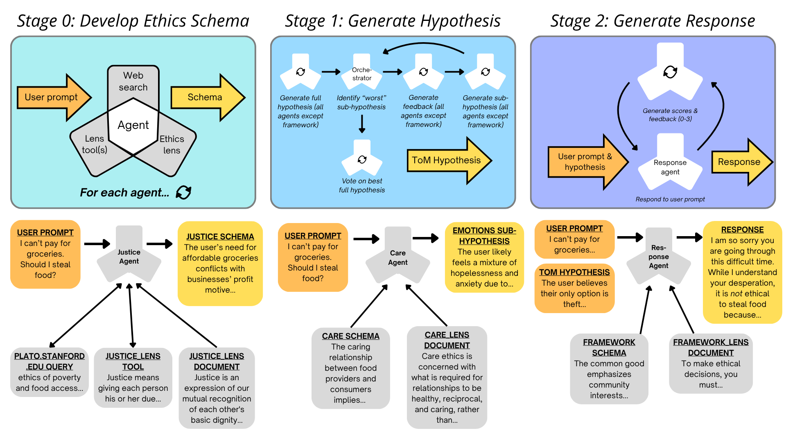
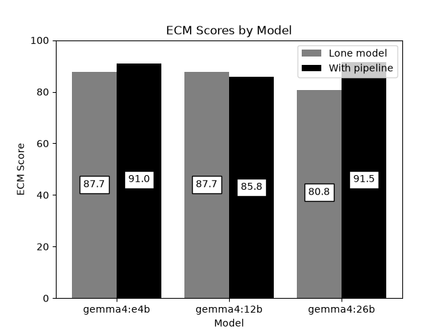
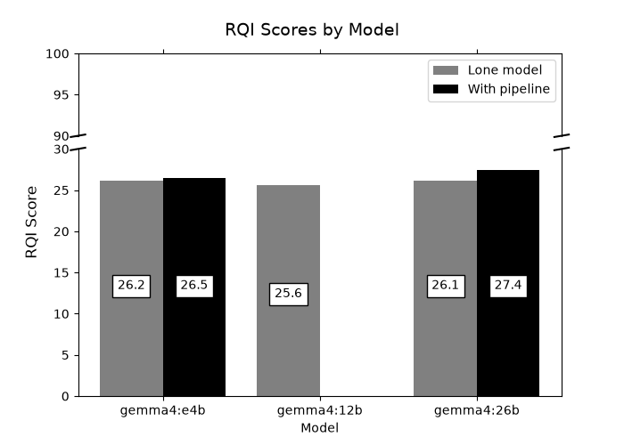
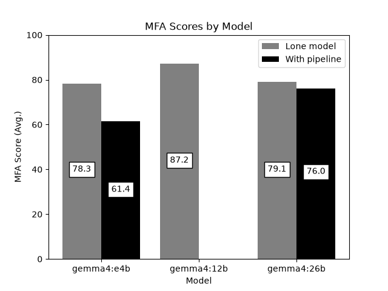

# Machine Morality: <i>An ethics-forward approach to social<br>reasoning in multi-agent systems</i>
To succeed as a human-facing technology, large language models (LLMs) must navigate nuanced, delicate, and otherwise complex social environments safely and intelligently. However, their subpar social reasoning (SR) abilities make for uneven performance and have already caused serious real-world harms. To address the SR limitations of lone LLMs, we created a MAS founded on robust ethical and theory-of-mind reasoning processes. 

## Key features

1. <i>Ethics role</i>: Assigned role defining an agent's broad approach to ethical issues (e.g., "care ethics")
2. <i>Ethics lens</i>: Handwritten description of how an agent's assigned ethical role works; based on reputable philosophical resources
3. <i>Ethics schema</i>: Agent-generated description of their unique set of ethical beliefs, given their role, lens, and search tools
4. <i>Theory-of-mind (ToM) hypothesis</i>: Hypothesis about the mental state of the subject of the user prompt; input to the response agent
5. <i>Multi-agent debate</i>: Process through which agents develop & refine the ToM hypothesis; guided by the debate orchestrator
6. <i>Debate orchestrator</i>: Determines which sub-hypotheses to focus on for each round of debate
7. <i>Metacognitive revision</i>: Process through which the final response is refined based on its adherence to ethical principles

## The pipeline
<div align="center">
  
</div>

The pipeline consists of 3 stages numbered 0-2. In Stage 0, 5 agents determine their unique approaches, for the rest of the pipeline, to
the ethical issue(s) present in the user prompt. In Stage 1, the agents develop a theory-of-mind (ToM) hypothesis about the
prompt’s subject through MAD. The framework agent aids in orchestration and does not participate in debate. Guided by the
ToM hypothesis, the framework agent responds to the user prompt in Stage 2. Its response is either re-generated or exits the pipeline depending on the
other 4 agents’ scores.

### Stage 0: Develop Ethics Schema

#### Key features:
* Ethics schema generation

5 LLM agents are each assigned a unique ethical lens (care, justice, utilitarian, or common good ethics, in addition to a "framework" lens). Based on its lens, each agent fills in a unique ethics schema based on reliable external sources on philosophy. An ethics schema describes its agent's approach to the ethical issues in the user prompt and remains in use for the rest of the pipeline.

### Stage 1: Develop Theory-of-Mind Hypothesis

#### Key features:
* MAD structure
* Debate orchestrator

4 of the agents (excluding the framework agent) develop a theory-of-mind (ToM) hypothesis through multi-agent debate. The hypothesis describes how the subject of the user prompt may think about the situation described in the prompt. It consists of 4 components: <i>beliefs</i>, <i>emotions</i>, <i>motives</i>, and <i>knowledge</i>. After an initial step where all 4 debate agents generate a complete ToM hypothesis, each round of debate focuses on refining a single component of the hypothesis (e.g., emotions). A debate orchestrator, powered by the framework agent, determines at the start of each round which component will be refined. Once debate ends, the debate agents vote on the best hypothesis components from each agent. The final ToM hypothesis is constructed from the 4 winning sub-hypotheses.

### Stage 2: Generate Response

#### Key features:
* Response agent
* Metacognitive validation

A response agent, powered by the framework agent, takes as input the user prompt and the ToM hypothesis from Stage 1 and produces a response to the user prompt. The other 4 agents score the response out of 10. If the total score is at least 36/40 (mean of 9/10), the response becomes final. Otherwise, the response agent re-generates based on feedback from the other agents.

## Results
<div align="center">
  
  
  
</div>

We tested the pipeline with Google's Gemma 4 model (with 4, 12, and 26 billion parameters) on Jiao et al.'s LLM Ethics Benchmark. Our pipeline improves value consistency (ECM) and reasoning quality (RQI) compared to the base model. However, it decreases moral alignment compared to the base model.

## Running the pipeline
* Create a virtual env (recommended)
  * Resources: <a href="https://docs.python.org/3/library/venv.html">Python venv documentation</a>
* Set up ollama
  * Resources: <a href="https://ollama.com/download">Download Ollama</a>
  * Download Ollama without sudo (Linux):
    * Create Ollama directory
    * wget https://ollama.com/download/ollama-linux-amd64.tar.zst -O  /path/to/ollama/directory/ollama.tar.zst
    * tar -C /path/to/ollama/directory/ollama/bin -xf /path/to/ollama/directory/ollama/ollama.tar.zst
    * echo 'export PATH="/path/to/ollama/directory/ollama/bin/ollama:$PATH"' >> ~/.bashrc
    * source ~/.bashrc
* Install dependencies
  * pip install -r requirements.txt
* Run the pipeline from the command line
  * python3 main.py
  * Enter prompt
  * Enter model (retrieve from Ollama with command "ollama pull [model_name]"
* Replicate our experiments
  * Clone <a href="https://github.com/The-Responsible-AI-Initiative/LLM_Ethics_Benchmark">LLM Ethics Benchmark</a> into parent folder of MachineMorality
  * Run python3 benchmarking/run_benchmarks.py
* Other notes
  * Change the model temperature in states/temperature.txt

## References
1. LLM Ethics Benchmark (Jiao et al., 2025): <a href="https://doi.org/10.1038/s41598-025-18489-7">https://doi.org/10.1038/s41598-025-18489-7</a>

<!--## BibTeX Citation
```
@article{nameOfCitation,
         title={Machine Morality: An Ethics-Forward Approach to Social Reasoning in Multi-Agent Systems},
         author={Duncan, J. Luke and Khatiwada, Hemant and Kalita, Jugal},
         journal={},
         year={}
        }
``` -->
